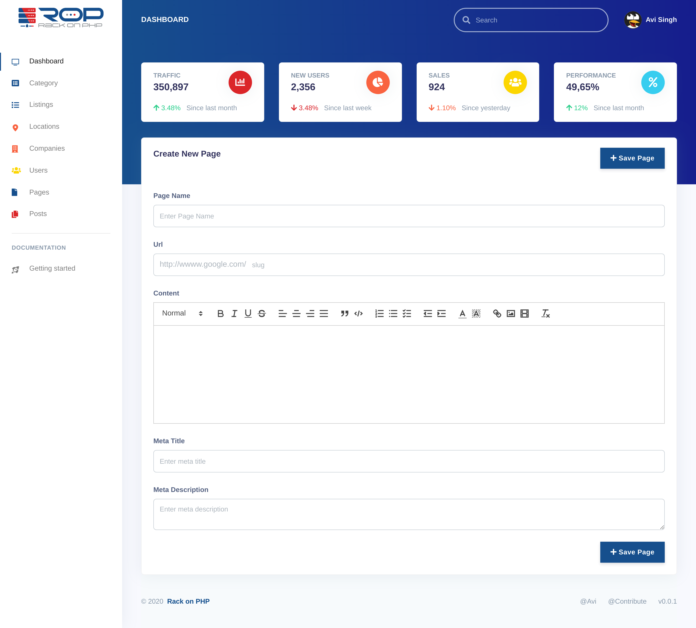

Rack on PHP 
===========
Rack on PHP is built on Laravel, Vue, Bootstrap. It is the open-source listing portal.

Requirements
===============
* PHP7.2+
* Mysql
* Composer
* NPM or Yarn

Credits
==============
* [Laravel](https://laravel.com/)
* [Vue](https://vuejs.org/)
* [Argon Dashboard](https://www.creative-tim.com)
* [Bouncer](https://github.com/JosephSilber/bouncer) - For the ACL
* [Laravel File Manager](https://github.com/alexusmai/vue-laravel-file-manager)
* [Sluggable](https://github.com/spatie/laravel-sluggable)

Sponsors
==============
Support us at [Patreon](https://www.patreon.com/avinashsinghrathi?fan_landing=true)

Notice
=============
This platform is under development. If you have any suggestions/feedbacks please feel free to let us know.
